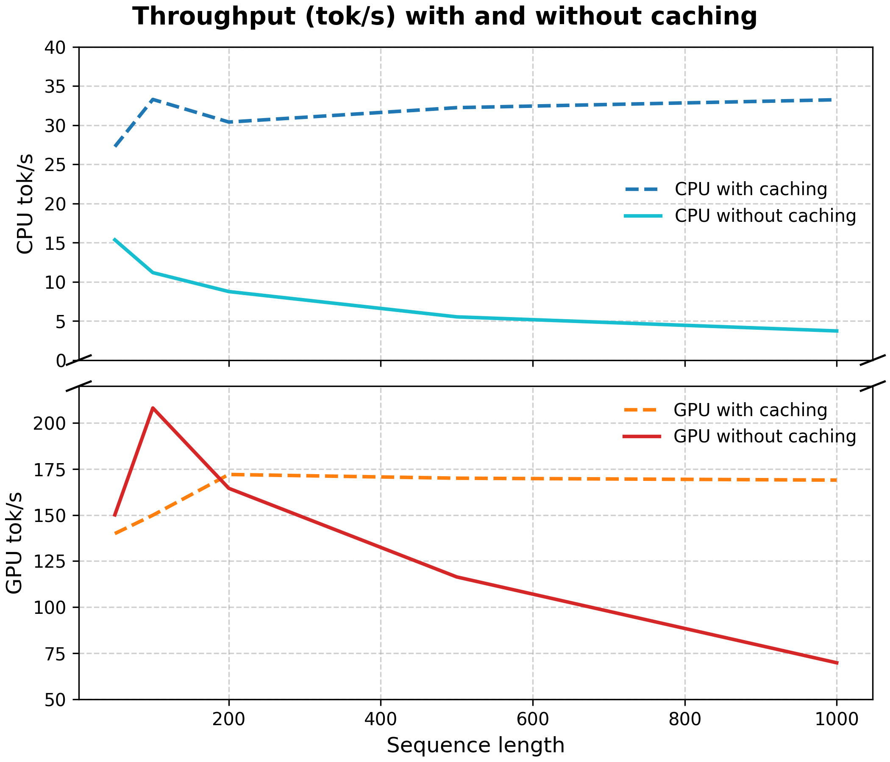

# 🚀 Simple GPT-2 Implementation with KV Caching

This repository provides a lightweight, from-scratch implementation of the GPT-2 language model using PyTorch. It demonstrates a decoder-only transformer architecture, including **key-value (KV) caching** for efficient autoregressive generation. The model loads pre-trained weights from Hugging Face's GPT-2 and supports inference with customizable sampling parameters. This project is ideal for educational purposes, showcasing the core components of a large language model (LLM) while highlighting optimizations like KV caching.

## ✨ Key Features

- **Decoder-Only Architecture**: Mirrors the GPT-2 structure with token and position embeddings, multi-head attention, MLPs, and layer normalization.  
- **KV Caching**: ⚡ Enables faster generation by storing and reusing key-value pairs from previous attention computations, reducing redundant calculations during autoregressive decoding.  
- **Sampling Methods**: 🎲 Supports temperature scaling, top-k, and top-p (nucleus) sampling for controlling the randomness and diversity of generated text.  
- **Benchmarking**: ⏱ Measures generation speed, including prefill time (for KV caching) and tokens per second.  
- **CLI Interface**: 💻 Easy-to-use command-line arguments for running inference.  

## 🏗 Architecture Overview

The model is built around a decoder-only transformer, similar to GPT-2. Key components:

- **KVCache**: Stores attention keys (K) and values (V) across generation steps. Maintains buffers for K and V, pushes new values during caching, and resets for new sequences.  
- **Attention**: Implements multi-head self-attention with causal masking, using linear projections for Q, K, and V. Integrates KV caching for efficiency.  
- **MLP**: Simple feed-forward network with GELU activation, expanding the hidden dimension by 4×.  
- **DecoderLayer**: Combines layer normalization, attention, and MLP with residual connections.  
- **DecoderOnly**: Main model class, including:
  - Token embeddings (`wte`) and position embeddings (`wpe`)  
  - Stack of `DecoderLayer` modules  
  - Final layer normalization and linear head for logits  
  - Methods for loading Hugging Face weights, resetting cache, and benchmarked generation  

**Forward Pass**: Computes embeddings, processes through layers (with optional caching), and outputs logits. Supports loss calculation for training (though this repo focuses on inference).

**Default GPT-2 Small Parameters**:
- Vocabulary size: 50257  
- Embedding dimension: 768  
- Layers: 12  
- Heads: 12  
- Context size: 1024  

## 🛠 Requirements

- Python 3.8+  
- PyTorch 2.0+ (CUDA support recommended)  
- Transformers (for loading pre-trained GPT-2 weights)  
- Tiktoken (for GPT-2 tokenization)  

Install dependencies via pip:

```bash
pip install torch transformers tiktoken
```

## 📥 Installation
```bash
git clone https://github.com/yourusername/simple-gpt2-kvcaching.git
cd simple-gpt2-kvcaching
# Install dependencies as listed above
```

## 🖥 Usage

Run inference using the provided CLI script. The model generates text based on a prompt, with options for KV caching and sampling controls.

### Command-Line Arguments

- `--prompt` (required, str): Input prompt for text generation (e.g., `"Once upon a time"`).  
- `--kvcaching` (flag): Enable KV caching for faster generation. Without this, attention is recomputed for the entire sequence each step.  
- `--device` (str, default: `"cpu"`): Device to run on (`"cpu"` or `"cuda"`).  
- `--max_tokens` (int, default: 50): Maximum number of new tokens to generate.  
- `--temperature` (float, default: 1.0): Controls randomness. Lower values make output more focused; higher values increase diversity.  
- `--top_k` (int, default: 0): Limits sampling to the top K most likely tokens (0 disables).  
- `--top_p` (float, default: 1.0): Nucleus sampling; selects smallest set of tokens whose cumulative probability ≥ P (1.0 disables).  

### Running Inference

Example:

```bash
python main.py --prompt "Once upon a time" --max_tokens 100 --temperature 0.8 --top_k 50 --kvcaching --device cuda
```

Output:
```bash
================================================================================
Generated text:
--------------------------------------------------------------------------------
Once upon a time, and are a new little I think, you may do it's always, the "I would be. I've been
taken all of the same, he was not a little you've a new-se-R's "the person from the last day's just
a long-toe_s are to be in a new and not for the "the new the new-I have just, you don't be too. The
other, we are used on a little more-M-
--------------------------------------------------------------------------------
Prefill time: 4.0075 seconds
Autoregressive tokens per second: 145.29
Decode time: 0.6883 seconds
================================================================================

```


This will:

- 📦 Load GPT-2 weights  
- 📝 Encode the prompt  
- ✨ Generate text using the specified parameters  
- ⏱ Output the generated text, tokens per second, prefill time (if caching enabled), and decode time  

## 🔍 Explanations

### KV Caching

KV caching optimizes autoregressive generation by storing keys and values from previous attention computations. Without caching, each new token requires recomputing attention over the entire sequence, leading to quadratic time complexity. With caching:

- **Prefill phase**: Full prompt is processed, K/V cached  
- **Generation phase**: Only new token’s Q/K/V are computed; attention uses cached K/V for previous tokens  

This significantly speeds up generation, especially for long sequences.

### Sampling Parameters

- **Temperature**: Scales logits before softmax. Values <1 make the distribution sharper (more deterministic), values >1 make it flatter (more random).  
- **Top-K Sampling**: 🎯 Restricts sampling to the K highest-probability tokens. Prevents unlikely choices but can limit creativity if K is too small.  
- **Top-P (Nucleus) Sampling**: 🌐 Dynamically selects the smallest set of tokens whose probabilities sum to at least P. Produces more natural outputs than top-K in many cases.  

These methods balance coherence and diversity in generated text.

The throughput (tok/s) is dependent on the KVCaching, device and the sequence length (max tokens):


*Figure: Tokens generated per second with and without KV caching.*

